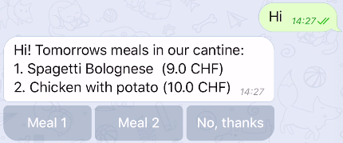
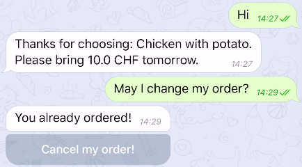
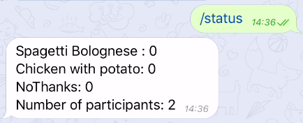
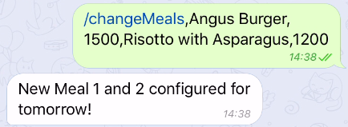
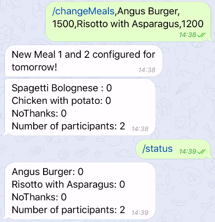

# foodBot

# Criteria

## A Planning

### The scenario
 
Cook and cafeteria owner who defines the food schedule for the upcoming weeks. Students and staff often don't know what they're about to have for lunch. This results in fewer meals being purchased because they do not know whether they should bring money or home-made lunch instead.

In addition to that it'd be useful being informed in case of sold out meals or changes in menu.
 
### Initial consultation with client and/or adviser
```
 - The evidence of consultation has been referred to in the scenario.
 - Any documentation associated with evidence of consultation has been linked to the cover page.
```

### The proposed product

An application that helps informing students and staff on a daily basis (~6:30 and 7:30 in the morning) about the upcoming meals that day. The application can be configured in advance for the upcoming meals of the week / month.

Optional: an interaction between the recipients of the information and their preferred choice for the upcoming meal could be made.

```
### Specific performance (success) criteria
 - Specific performance criteria have been drawn up that make it possible to evaluate the success of the product in criterion E.
```

## B Design

### [Record of Tasks (ROT)](workLog.txt)

```
### Test plan 
for sucesss criteria
```

```
### Brief summary of methods 
```

### Design of the solution 

#### UML - Use Case diagrams

```
[Admin]-(current order status),
[Admin]-(plan next meals),
(plan next meals)>(change meals),
(change meals)>(current order status),
[Customer]-(place order),
[Customer]-(change order),
[Customer]-(cancel order),
(change order)>(cancel order),
(change order)>(place order)
```


#### UML - Activity diagrams

##### Customer POV: Place meal order 
```
(start)->(open Telegram),
(start)->(receive meal push notification),
(receive meal push notification)->(receive meal choice),
(Open Telegram)->|a|->(start Foodbot conversation)->|b|,
|a|->(open Foodbot conversation)->|b|,
|b|->(send message)-><z>[not ordered]->(receive meal choice)->|c|,
<z>[already ordered]->(cancel order?),
(cancel order?)-><y>[yes]->(order up to date?),
(order up to date?)-><x>[yes]->(cancel confirmation),
<x>[no]->(receive confirmation),
<y>[no]->(send message),
(cancel confirmation)->(send message),
|c|->(choose meal 1)->|d|,
|c|->(choose meal 2)->|d|,
|c|->(no thanks)->|d|,
|d|->(receive confirmation),
(receive confirmation)->(send message),
(receive confirmation)->(end)
```


##### Admin POV: Change meal process

```
(start)->(open Telegram),
(Open Telegram)->|a|->(start Adminbot conversation)->|b|,
|a|->(open Adminbot conversation)->|b|,
|b|->(wait for instructions),
(wait for instructions)->(send status),
(send status)->(receive status)->(wait for instructions),
(wait for instructions)->(send meal plan),
(send meal plan)->(send confirmation),
(send confirmation)->(wait for instructions),
(wait for instructions)->(change meals)->(end)
```


### Graphical Visualization

Of the output:

#### Customer POV

##### Meal choice



##### Choice cancellation



#### Admin POV

##### Order status



##### Plan next meal



##### Meal change



### Test plan 
For success criteria

| Test type | nature of test | Example |
|-----------|----------------|---------|
|           |                |         |
|           |                |         |
|           |                |         |

## C Development

### UML Model

```
[AdminBot|orderBot:OrderBot|onUpdateReceived();getBotUsername();getBotToken()],
[FoodBot||static void main()],
[OrderBot|choices:Map;chatIdsWithOrders:Map;allTimeChatIds:Set|reset();changeMeals()],
[Meal|name:String;price:int;amountOfOrder:AtomicInteger|],
[TelegramLongPollingBot||onUpdateReceived();getBotUsername();getBotToken()],

[FoodBot]-instantiates>[OrderBot],
[FoodBot]-instantiates>[AdminBot],

[TelegramLongPollingBot]^[OrderBot],
[TelegramLongPollingBot]^[AdminBot],

[AdminBot]->[OrderBot],

[OrderBot]->[Meal],
[AdminBot]->[Meal]
```


```
### Screenshots  
```

```
### Identification of sources used with citation
 - e.g. Telegram library and examples
```


### Examples  

#### 1
#### 2
#### 3
#### 4
#### 5
#### 6
#### 7 


## D Functionality

### running

```
mvn clean verify exec:java
```

### video 

[](https://www.youtube.com/watch?v=1H95Bqd535E)

### script
#### key features
#### success criteria
#### extension points 

## Evaluation

### met sucess criteria
### client response
### future improvement
