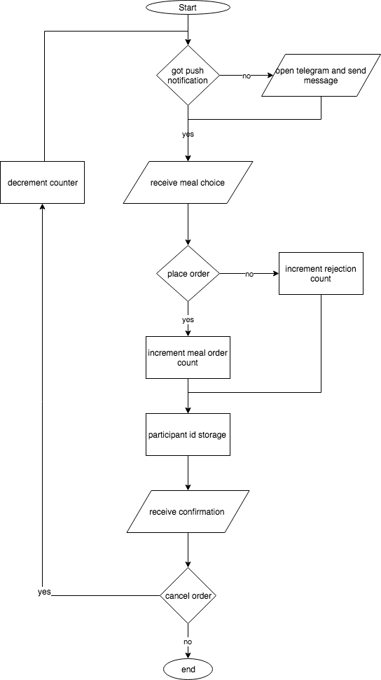

# foodBot


# Criteria

## A Planning

### The scenario
In school I realised that I was never certain on what to eat in school, because I never knew what the school was planning on having for the next day. As my I was looking for a Computer Science IA, the idea of solving the problem for my lunch schedule was ideal. The students have to know the evening before hand what they are going to eat. If they would get informed a day before, they could decide whether they want to eat in school or bring their own food from home. 

The idea of a telegram chatbot came to my mind as it is an automation system and can therefore be used to send respond messages to the students and inform them about the meal. The bot will also have a tool to communicate with the kitchen staff to ensure safe organisation. Students will have the option to choose in the chat conversation and the bot will inform the kitchen on how many meal items to prepare for the next days meal.

Cook and cafeteria owner change their meal plan everyday and present them in the caffetitria. Students and staff therefore  don't know what they're about to have for lunch. This results in fewer meals being purchased because they do not know whether they should bring money or home-made lunch instead. As the cooks can now tell more precicly how much food is demanded, they can reduce their waste of food. 

In addition to that it'd be useful being informed in case of sold out meals or changes in menu.
 
### Initial consultation with client and/or adviser
```
 - The evidence of consultation has been referred to in the scenario.
 - Any documentation associated with evidence of consultation has been linked to the cover page.
```

### The proposed product

An application that helps informing students and staff on a daily basis (~6:30 and 7:30 in the morning) about the upcoming meals that day. The application can be configured in advance for the upcoming meals of the week / month.

Optional: an interaction between the recipients of the information and their preferred choice for the upcoming meal could be made.

```
### Specific performance (success) criteria
 - Specific performance criteria have been drawn up that make it possible to evaluate the success of the product in criterion E.
```

## B Design

### [Record of Tasks (ROT)](workLog.txt)

```
### Test plan 
for sucesss criteria
```

```
### Brief summary of methods 
```

### Design of the solution 

#### UML - Use Case diagrams

```
[Admin]-(current order status),
[Admin]-(plan next meals),
(plan next meals)>(change meals),
(change meals)>(current order status),
[Customer]-(place order),
[Customer]-(change order),
[Customer]-(cancel order),
(change order)>(cancel order),
(change order)>(place order)
```


##### FlowChart: Customer POV - Place meal order



#### UML - Activity diagrams 


##### Admin POV: Change meal process

```
(start)->(open Telegram),
(Open Telegram)->|a|->(start Adminbot conversation)->|b|,
|a|->(open Adminbot conversation)->|b|,
|b|->(wait for instructions),
(wait for instructions)->(send status),
(send status)->(receive status)->(wait for instructions),
(wait for instructions)->(send meal plan),
(send meal plan)->(send confirmation),
(send confirmation)->(wait for instructions),
(wait for instructions)->(change meals)->(end)
```


### Graphical Visualization

Of the output:

#### Customer POV

##### Meal choice


##### Choice cancellation


#### Admin POV

##### Order status


##### Plan next meal


##### Meal change


### Test plan 
For success criteria

| Test type | nature of test | Example |
|-----------|----------------|---------|
|           |                |         |
|           |                |         |
|           |                |         |

## C Development

### UML Model

```
[AdminBot|orderBot:OrderBot|getBotToken();getBotUsername();notifyNewMealsSend();onUpdateReceived();getNewMeal1();getNewMeal2()],
[FoodBot||static void main()],
[OrderBot|allTimeChatIds:Set;chatIdsWithOrders:Map;choices:Map|changeMeals();reset();toString();onUpdateReceived()],
[Meal|amountOfOrder:AtomicInteger;name:String;price:int|toString()],
[TelegramLongPollingBot||getBotToken();getBotUsername();onUpdateReceived()],

[FoodBot]-instantiates>[OrderBot],
[FoodBot]-instantiates>[AdminBot],

[TelegramLongPollingBot]^[OrderBot],
[TelegramLongPollingBot]^[AdminBot],

[AdminBot]->[OrderBot],

[OrderBot]->[Meal],
[AdminBot]->[Meal]
```


```
### Screenshots  
```

```
### Identification of sources used with citation
 - e.g. Telegram library and examples
```


### Examples  

#### 1
#### 2
#### 3
#### 4
#### 5
#### 6
#### 7 


## D Functionality

### running

```
mvn clean verify exec:java
```

### video 

[](https://www.youtube.com/watch?v=1H95Bqd535E)

### script
#### key features
#### success criteria
#### extension points 

## Evaluation

### met sucess criteria
### client response
### future improvement
